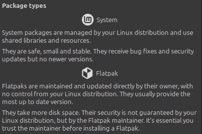
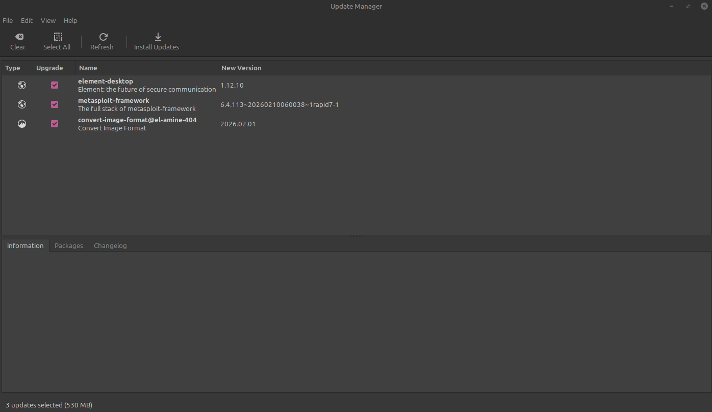
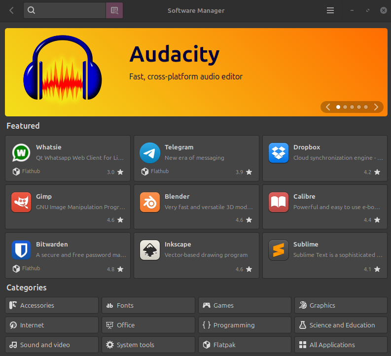

[**Click here to go back to the main page**](./README.md)
# Introduction
This guide is made for people who know little about computers to help them install Linux Mint in a way they can understand.

If you have a specific question, feel free to create an issue with the "Question" type in the repo. I'll try to answer them. Please be coherent in your asks, I don't want any question like "my screen looks weird" with a grainy image and no description.
# Common Terms and Questions

## Why switch?
There are many reasons one may want to switch to a Linux based operating system.
### Microsoft Windows is generally just ass
For one, Microsoft Windows sucks. It's bloated, full of spyware that tracks your every move, has ads built into the OS, and is full of bloat. Searching a singular folder should not take 30 seconds. It dosen't on Linux.

Microsoft Windows is also closed source and paid, which is bad in itself. Imagine buying a car, and then when you open up the engine, instead there is just a few plugs and a giant black cube. That's what closed source software is like.

### Care about your privacy
Microsoft Windows violates your privacy constantly. With recall screenshotting you, and it tracking whenever you start an app. Debloaters can only help so much. Why use an operating system designed to exploit the user for profit rather than working with them?

### Performance (and Battery Life)
Linux, even through compatability layers, can give better gaming performance, due to lack of bloat and more efficent management of system resources. It can also increase your battery life because of similar reasons, and smarter power management. I noticed a near doubling of my Laptop's battery life personally when I switched.

## What is a Linux?
Linux is *technically* just the [kernel](https://en.wikipedia.org/wiki/Kernel_(operating_system)).  But when people say [Linux](https://en.wikipedia.org/wiki/Linux), they are generally reffering to a distribution, or ["**distro**"](https://en.wikipedia.org/wiki/Linux_distribution) of the [Linux Kernel](https://en.wikipedia.org/wiki/Linux_kernel).

### The Linux Kernel

### Distributions
A distribution, or "distro", is generally an OS built off of the Linux Kernel, often utilizing GNU and FOSS components to make a desktop operating system. Different distros may be designed for different things and use different pieces of software and have differing levels of ease of use.

There may be distros designed for other things (like [OpenWRT](https://en.wikipedia.org/wiki/OpenWrt)), but that's beyond the scope of this guide. Here we will talk about desktop and user oriented distros.

## Why Linux Mint?
This guide discusses installing Linux Mint.

[Linux Mint](https://linuxmint.com/) is a very user friendly distro. You can do most basic tasks without needing to use the command line. It's also very stable, and won't just break.

### User Friendliness
It has full GUI that's capable of doing tasks without needing the terminal, which makes it more comfortable for refugees from Microsoft Windows that are not used to the command-line yet.

### Stability & Reliability
Linux Mint is a stable and reliable distro that is focused on that rather than being bleeding-edge.
It also comes with a handy *Timeshift* backup tool, so if you happen to break something, you can just roll back all the important system files that you broke.

### Less Terminal Required
Linux Mint has many GUIs for doing most tasks, minimizing the need to use the command line, if at all. This is often a bonus for new users. However, learning the command line should be something most users do in time on their own.

## Why open source?
See section on FOSS and SaaS.

### Is it dangerous to use open source systems?
No. Code is reviwed and worked on by many developers around the world, and bugs are fixed quickly.

## What is a Package Manager?
A good article written to explain this [can be found here](https://itsfoss.com/package-manager/).
Note that Linux Mint uses the `apt` and `flatpak` package managers.

### Linux Mint uses apt and flatpak. What's the difference?
The Linux Mint GUI software manager actually explains it in simple terms pretty well.

For most software, installing the flatpak is better than the system (`apt`) package, because it is more up to date. There are some exceptions to this, like Steam.

## What is a UEFI BIOS?

In short, it stands for [**U**nified **E**xtensible **F**irmware **I**nterface](https://en.wikipedia.org/wiki/UEFI) [**B**asic **I**nput **O**utput **S**ystem](https://en.wikipedia.org/wiki/BIOS)

That probably means nothing to you though and isn't very helpful. This is the case for most people, which is completely normal. Annoyingly, some people still call it the **BIOS**, though it should really be just called the **UEFI**. For the sake of clarity, in this guide it is reffered to as the **UEFI BIOS** for ease of description.

The UEFI BIOS is the level of your computer below the Operating System and is generally built into your motherboard by your manufacturer. It takes form of a simple GUI that lets you decide things such as various core hardware functions and which drive to boot from. This will be important in booting a new Operating System.

## What is "FOSS" and "SaaS"?

### SaaS kinda sucks

SaaS stands for [Software as a Service](https://en.wikipedia.org/wiki/Software_as_a_service). Although sounding mundane, it is often a predatory system wherein you don't actually own anything, and don't know how the software you use works or what data it collects because it is closed source. Generally not ideal.

> SaaS separates "the possession and ownership of software from its use."

Examples of SaaS companies could be Adobe, Microsoft, and Todo.

### Closed source is dumb
Imagine paying for a software and not even knowing what it does or how to fix it. It's an enigma. You have no way to know what it does without your permission, and the company randomly breaks stuff. Sound familiar? Microsoft Windows is a closed source SaaS system.

SaaS companies (like Microsoft) also have a record of knowing about significant security vulnerabilities, but not spending time to patch them until a massive hack happens because it saves them money in the short term.

### Why open source is ideal
Open source means that the source code for a piece of software is visible to the public. This means people can independently verify that it is safe and does not spy on you, plus people can contribute to a lot of open source projects to improve them.

If a bug or security issue is found, the devs are obligated to fix it via common sense. If they don't, someone will just make a fork where that bug is fixed and everyone will start using that instead.

### FOSS is freedom
Controlling your software is important. Without that control, you only have the freedom that the company making it says is allowed. With FOSS, you can do whatever you want.

## Can I still play my games on Linux?
Yes.
For some games, they have a release that is Native to Linux, and so will just run normally.
In the case a game does not have a Native to Linux release, most users will utilize WINE and Steam Proton to play those games.
### WINE

WINE is a compataiblity layer that translates Microsoft Windows function calls into POSIX-compliant function calls, with negligible performance overhead. It's not an emulator.

#### Wait but how does it work?
**The easiest way I can explain how WINE works is something like this:**

*Note: These are not real functions and this is heavily simplified. I am just making an example.*

Let's say Microsoft Windows has a function `OpenFile(name, path)`. It opens a file, and takes two arguments, the `name` of the file and the `path` to said file on the filesystem.

Linux has a similar function `fOpen(location)`. This function also opens a file, but it has a different name and only takes one argument, `location`, which just points directly to where the file is on the filesystem.

WINE translates between the two. So when a game built for Microsoft Windows is running via WINE, it would call `FileOpen(test.txt, C:\PATH\TO\FILE\)`. WINE will see this and make Linux do `fOpen(/path/to/file/test.txt)`, and return the result in a way the Microsoft Windows program can understand. 

This is a very simplified and unrealistic explanation, but it gets the point across.

#### Winetricks GUI
There is a GUI implementation of some WINE usage with the `winetricks` package. It also allows for some advanced configuration.

### Steam Proton
Steam Proton is a fork of WINE made by Valve. It's the same technology that lets Windows native games run on the Steam deck, and Steam on Linux comes with it by default, which you can use to run your entire Steam Library. 

If you want to see if a game will run on WINE/Proton, head over to `protondb` and check.

## What if an application I use is not availible in Linux natively?

### FOSS Alternatives (preferable)
The first and ideal option here is to find a FOSS software that does a similar thing to what you need while being native to Linux.

### WINE (if you must)
If a software does not have native Linux support, with some basic tinkering ypu can usually get it installed and running via WINE or [Winboat](https://www.winboat.app/) (which is like a mini virtual machine that can run any Microsoft Windows program seamlessly, but is not very good for games so it was not mentioned here).

## Can I use INSERT_SOFTWARE_NAME_HERE on Linux?

Use your preffered search engine. If there is a Ubuntu or Linux Mint `.deb` package availible (`apt`), or a `flatpak`, then you are good.

### WINE and Compatability Layers (See games section)
You can use compatability layers to run non-native software.

### Using software that is hostile to your OS choice and why thats really not making the situation any better
Intentionally using software thats designed not natively for your OS kinda defeats the point of getting more support for said OS family.

### "But I need MS office for work/school!!!11!!"
**All MS office apps are availible in any modern browser as webapps. You do not need to download anything to use them.** If you need to, you can easily edit `.doc` and `.docx` files in LibreOffice easily, in addition to other prorietary document formats.

## I need a software that does $INSERT_THING_HERE on Linux! (FOSS Software Alternatives List)

### 2D Graphics
* [Krita](https://krita.org/) - Digital Art
* [Inkscape](https://inkscape.org/) - Vector Graphics
* [GNU Image Manipulation Program](https://www.gimp.org/downloads/) - Image editor similar to Adobe Photoshop

### 3D Graphics
* [Blender](https://www.blender.org/) - Pretty much everything under the sun

### CAD
* [FreeCAD](https://www.freecad.org/) - Parametric CAD 3D Modeler

### Audio
* [Audacity](https://www.audacityteam.org/) - Audio Manipulation, Recording, and Editing
* [LMMS](https://lmms.io/) - Fully Functional DAW

### Video
* [Blender](https://www.blender.org/) - Video Editing
* [Kdenlive](https://kdenlive.org/) - Video Editing
* [Handbrake](https://handbrake.fr/) - Video Transcoder

### Documents
* [LibreOffice](https://www.libreoffice.org/) - Full Office Suite
  
> *`LibreOffice` comes preinstalled with Linux Mint Cinnamon.*

### Coding
* [neovim](https://neovim.io/) - Fork of `vim` designed for programming, can be made into an IDE
* [Vscodium](https://vscodium.com/) - Visual Studio Code binaries but without the Microsoft Bullshit

### Text Editors
* [vim](https://www.vim.org/) - Well known and respected text editor
* [xed](https://github.com/linuxmint/xed) - Lightweight and simple text editor, similar to `Notepad` on Microsoft Windows.

> *`xed` comes preinstalled with Linux Mint Cinnamon.*

### Email Client
* [Thunderbird](https://www.thunderbird.net/) - Email Client made by Mozilla

> *`Thunderbird` comes preinstalled with Linux Mint Cinnamon.*

### Browsers
* [Brave](https://brave.com/) - Chromium Broswer focused on Privacy with built in Ad blocking.
* [Waterfox](https://www.waterfox.com/) - A fork of firefox with some additional functionality and less Mozilla stuff.
* [Firefox](https://www.firefox.com/) - Everyone knows what Firefox is. It's FOSS.
  
> *Linux Mint Cinnamon comes with `Firefox` as it's default browser out of the box. Of course, you can replace or uninstall it any time. Unlike Microsoft Windows.*

### Misc
* [copyparty](https://github.com/9001/copyparty) - Flexible and lightweight fileserver written in Python

# Prerequisites
This guide assumes you have a computer running Microsoft Windows and would like to move to Linux Mint.
It also assumes you can use a search engine to solve problems and don't suffer from general learned helplessness or critical thinking deficency.

Here's a few things you should know.

## Step -2: Ask yourself if you have any files on your Microsoft Windows machine that you would like to have after the switch. 

This is because Linux uses different file system(s) to Microsoft Windows, so your OS drive (generally the largest one thats not external) will need to be formatted during the install.

**If you have files you would like to keep,** I reccomend backing up any files you would like to keep somewhere else during the install. Purchasing an external storage to save any files you want is a great way to do this.
**If you do not care about any of the files on the machine,** you can safely ignore this and move to the next preparation step.

## Step -1: Get a 32GB or larger USB stick.
Do what the step says. You will need this to create a bootable USB of Linux Mint, which you will use to easily install it. Linux Mint is a different operating system, not a Windows installer program.

# Step 0: Creating the Bootable USB 
The reason you need to make a Bootable USB is because you need to boot Linux Mint to install it. When your computer starts up, it looks through your drives and devices for any Operating Systems that it can boot, then decides which one it should boot based on the boot order set in your UEFI BIOS. You need a temporary flash drive to boot off of, because right now Microsoft Windows takes up all the space, and Linux Mint is built to install from USB.

## Downloading Rufus
Microsoft Windows does not come with a bootable USB creator, because they want to force you to stay in their system. That is why you'll need to download the Rufus tool, to create a Bootable USB. Go to the [Rufus website here](https://rufus.ie/) and download it.

## Downloading the .iso file
The second part needed is an *ISO Image* file. This basically contains a bunch of compressed information about an OS, that you can use with a tool like Rufus to flash to a USB into something that can be booted from.

You will be downloading the ISO for Linux Mint Cinnamon, [which can be found here.](https://linuxmint.com/edition.php?id=326) Choose a mirror that will be fast for you.

## Flashing the .iso to the USB
Actually flashing the USB is fairly simple.
* Open up Rufus, and select your `.iso` file you downloaded.
* Select your USB Drive as the target. (The default settings it selects should work fine)
* Hit "Start" and wait for it to finish.
* When it finishes, congratulations. Move on to the next step.

# Step 1: Accessing the UEFI BIOS
Next, you need to access your computer's UEFI BIOS (discussed earlier), the level below the operating system. This is so that you can disable a few settings that will prevent Linux Mint from working, and tell the computer to boot from the USB you just flashed instead.

## Finding your UEFI BIOS key
First, you need to know what keys to press on boot to open the UEFI BIOS instead of booting. This is determined by your motherboard manufacturer. For laptops is just the same as the company who made it, for desktops you may want to look inside or find out how to find your motherboard information in Microsoft Windows. The Key combination to press can usually be looked up online, or in your motherboard's manual in case of a desktop. On some devices it may say on the display when it boots what key to press. If it does not, consult the internet.

## Entering the UEFI BIOS
Once you have found the UEFI BIOS key or keys to press (you may have to try a few different combinations), fully shut down your computer. Then, turn it back on and spam those keys as it boots. If Microsoft Windows boots, you have failed to enter the UEFI BIOS, turn it off and try again. If you instead see a screen that does not look like anything you recognize and has the words "BIOS" or "UEFI" somewhere, congratulations! You are in the BIOS. 

# Step 2: Configuring the UEFI BIOS
First, a few settings need to be configured.

## Disabling certian unwanted settings
You will need to disable certian settings that will prevent Linux Mint from functioning.

### Fast boot
Fast boot is a feature built into motherboards wherein Microsoft Windows does not fully shut down. This is because Microsoft Windows is so slow and bloated to boot, they have to cheat so that it does not take three minutes to boot. Obviously if part of Microsoft Windows is still loaded when we are trying to use Linux, that is a problem. Therefore, you will first need to navigate your UEFI BIOS settings. If you have searched all the menus and do not see a "Fast boot" option, then it probably does not exist on your motherboard and you can skip this step. If you see it, change it from `enabled` to `disabled`, in the case it is `enabled`.

### "Secure" boot
Secure boot is another feature that is supposed to somehow protect you, but really locks you in to Microsoft. Microsoft works with companies to put this in most motherboards. Signing an OS for secure boot requires keys from Microsoft, so Linux does not and can't use it. It's supposedly to protect if your computer gets stolen, but nothing is stopping a determined criminal from just moving your storage to a different motherboard with secure boot disabled and analyzing it there.
> Secure boot prevents the install of drivers not signed by Microsoft, such as those used by Linux.

Anyways, it needs to be disabled. It will probably be located in the Boot or Security settings of your UEFI BIOS. find it, and disable it. Note that from this point onwards, Microsoft Windows will likely be unrecoverable if you have BitLocker enabled.

## Changing the boot order
Finally, you need to change the boot order. This tells your computer which device to attempt to boot from first. You want it to boot from the USB first before Microsoft Windows. When Linux Mint installs, it will automatically put itself at the top of the order, so you do not have to worry about this except once.

---

For example, your boot order might look like this:
|BOOT ORDER|
|---|
|Windows Boot Manager|
|CD Disk|
|Hard Disk|
|USB Disk|

---

You will want to change it so the USB is on the top of the boot order, perhaps looking something like this.

|BOOT ORDER|
|---|
|USB Disk|
|Windows Boot Manager|
|CD Disk|
|Hard Disk|

## Save changes and restart
Once you have adjusted the boot order, you can safely find the "Save Changes and Restart" (or similar wording) in your UEFI BIOS. Make sure you select the option to save changes. Then you can, well, save changes and restart your machine from the UEFI BIOS to boot Linux Mint.

# Step 3: Boot and Install
Now, you are going to boot Linux Mint as a Live Image, and install it.

## When you boot
When you first boot, a menu will probably come up with a few options, one of them saying something like "Start Linux Mint Cinnamon". Navigate to that and press `ENTER`.

### If the standard boot doesn't work
Try the same thing, but with the compatability mode boot. Feel free to make an issue in the repo here if you are still having trouble.

## The Live Image
**JUST BECAUSE YOU BOOTED DOES NOT MEAN LINUX MINT IS INSTALLED.**
Once you get to the desktop, you are inside what is known as a "Live Image". This is running only in memory, and nothing will be saved on reboot. Do not do anything here but proceed with the install. You may need to install additional software or drivers after installing Linux Mint itself for all your hardware to function fully. If you are having internet issues, read down to the step discussing it below.

## Installing Linux Mint
Simply double-click the "Install Linux Mint" button in the top right corner, and the install window will pop up. Follow its instructions, it is simple. A few things to remember/follow are listed below, along with clarifications.

* When it asks you if you want to install multimedia codedcs, check the box. Otherwise you will not be able to play some video and audio formats.
* When the installer asks you if you want to keep Microsoft Windows or Erase drive and Install, select "Erase drive and install Linux Mint". You are leaving Microsoft's corporate shit behind. **MAKE SURE YOU HAVE THE RIGHT DRIVE SELECTED FOR THE INSTALL. You can use the built-in*****Disks*** **tool to help identify which one you want to install to. It will be the one with the Microsoft Windows NTFS partition.**

* When the installer asks you for what seems like your location, it is not trying to spy on you. It simply wants to know your timezone, and you can click to set it.
* Once the install is complete, click "Restart" in the installer to finish the install. The installer will then prompt you to remove the "installation medium" (this means the USB drive you used to install) and press `ENTER`. Do that.
* Do not remove the drive at any point before that.

### What if my wifi is not working/showing up on Linux?
Open up the Mint Menu in the Live Image before installing. Search for the *Driver Manager*, and open it. You will likely see a driver listed for a Broadcom device. Broadcom is a shitty company that does not provide open source drivers for their hardware, and thus they cannot be integrated into the Linux Kernel, and must be installed seperately. You will need some other source of internet to install them once Linux Mint is installed. In the case you are in this kind of situation, Purchase a Linux Compatible USB Wifi dongle before proceeding with the install. You will use this to provide a temporary Wifi connection enough to install the Broadcom driver. Once you have done so, you will be able to plug the dongle in to get Wifi until you can install the driver. *You cannot install drivers to a Live Image.*

> The creator of this guide can personally reccomend [this dongle](https://www.amazon.com/Panda-Ultra-150Mbps-Wireless-Adapter/dp/B00762YNMG).

# Step 4: Post-install
Upon reboot, log in! You've made it.
**However, there are still a few more important things to do.**

## Welcome Menu
The first time you login, Linux Mint will greet you with a welcome menu. Reading all of it's information is actually very helpful, and you should, and maybe do some of what it reccomends.

## Update Manager
Linux Mint handles all its updates through the GUI Update Manager. Updating regularly is important. If you are prone to forget to update manually, I advise you turn on all of the update automation settings of the Update Manager, or setup a `cronjob` to update your system if you are more technical.

## Drivers (Very Important)
Installing drivers is important. Most hardware has drivers built into the Linux Kernel, but some may need to be installed seperately. Drivers are like an instruction manual for the computer on how to use the hardware. Without it, the computer can see the hardware, but has no idea how to use it. Linux Mint has a GUI driver manager to help you with installing most additional drivers.

---

If you have an NVIDIA GPU, you will want to open up the *Driver Manager* and install the reccomended driver version. It may ask for authentication, and then you will need to restart after the install. **If you want your GPU to function normally, you will need to do this.**

---

You may also need to install drivers for things like drawing tablets seperately. Instructions are usually found on various company websites, often it is simply a `.deb` package you have to download and double click to install. If that is still confusing to you, feel free to make a help request as an issue in this repo as previously stated.

### Continuation from Step 3: What if I don't have Wifi in linux but I do on Windows?

In a step similar to the NVIDIA GPU drivers, you will need to open up the *Driver Manager.* Using your USB Wifi dongle, you will be able to download and install the drivers required to make your adapter work, after which you can use your built-in Wifi.

**Fuck Broadcom**

## Installing applications
Applications can easily be installed from the *Software Manager* GUI. Any additional appplications you need not availible here will usually have install instructions on their website if you simply search for them.

## Reccomendations from the author
Stuff I reccomend you do.

### Ublock Origin in Firefox
Install the Ublock Origin extension in Firefox. It's a FOSS adblocker, and will also protect you from malvertising.

# HELP! I still can't install!
Make an issue in the Repo and I will try to help you out best I can.
